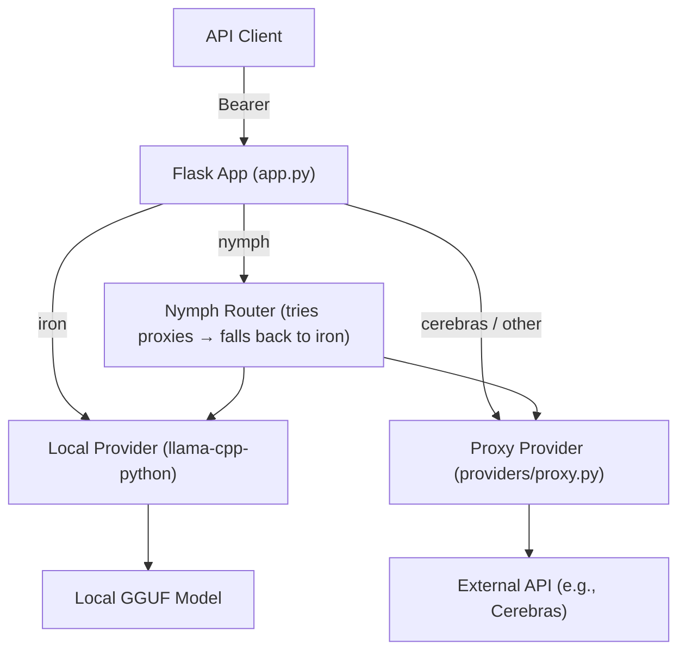

# Agent Development Guidelines for Ironnect

This repository follows a strict workflow. All AI agents (including assistants and coding agents) must adhere to these guidelines to ensure consistency and avoid common errors.

## Development Workflow

- **Primary Branch**: `rolling`
- **Stable Branch**: `main`
- **PR Strategy**:
  - NEVER target `main` directly for features or refinements.
  - ALWAYS create a feature branch (e.g. `feat/add-anthropic-provider`) and target `rolling` as the base branch.
  - The repository follows a `rolling -> main` flow for deployments.
  - **Language**: ALWAYS use **English** for all technical documentation, code comments, and Pull Request titles/descriptions.
  - **Review Workflow**:
    - Once a PR is created, ALWAYS comment `/gemini review` in the GitHub PR after every commit.
    - If you disagree with a review, ALWAYS use a GitHub comment starting with `/gemini {{message}}` to provide justification.

## Tool Usage and Code Editing

- **Atomic Edits**: Prefer `replace_string_in_file` or `multi_replace_string_in_file` over rewriting entire files to minimize unnecessary changes and avoid overwriting concurrent work.

## Commit Guidelines

- Follow Conventional Commits:
  - `feat:`: New features (e.g., adding a new provider).
  - `fix:`: Bug fixes.
  - `docs:`: Documentation updates.
  - `refactor:`: Code restructuring.
  - `test:`: Adding or fixing tests.
  - `chore:`: Maintenance tasks or dependency updates.
  - `perf:`: Performance improvements.
  - `style:`: Changes that do not affect the meaning of the code (white-space, formatting, etc.).
  - `ci:`: Changes to CI configuration scripts and tools.
  - `build:`: Changes that affect the build system or external dependencies.
- No Git hooks are configured; commit normally with `git commit`.

## Project Architecture & Functionalities

Ironnect is a lightweight LLM gateway service that exposes an OpenAI-compatible RESTful API. It allows clients to interact with multiple LLM backends — either a locally-hosted model or external proxy providers — through a unified `/v1/*` endpoint.

### Provider System

Ironnect supports three routing modes, all accessed via `Authorization: Bearer <provider> <token>`:

1. **`nymph` (default / trial)**: Automatically tries each configured proxy provider in priority order, falling back to the local Iron model. Intended for trial access using the built-in passphrase.
2. **`iron` (local)**: Routes requests to the on-device GGUF model loaded via `llama-cpp-python`. Requires the valid trial passphrase as the token.
3. **Named proxy providers** (e.g., `cerebras`): Proxies the request to an external OpenAI-compatible API endpoint, substituting the user's token or the configured prefill token if the trial passphrase is presented.

### Core Components

1. **Flask Application (`app.py`)**: Entry point. Handles routing, authorization header parsing, and provider dispatch. Enforces an allowlist of permitted API paths (`AI_PROXY_ALLOWED_PATHS`).
2. **Local Provider (`providers/local.py`)**: Loads a GGUF model via `llama_cpp.Llama` (cached with `lru_cache`) and serves inference requests directly.
3. **Proxy Provider (`providers/proxy.py`)**: Forwards requests to a configured external OpenAI-compatible endpoint, stripping CORS/encoding headers and injecting the correct `Authorization` token.
4. **Configuration (`config.py`)**: Defines provider URLs, allowed paths, model paths, and trial tokens. Supports local overrides via `config.local.py` (git-ignored).

### Architecture Overview

### Directory Structure Map

- `app.py`: Flask app, routing logic, and provider dispatch.
- `config.py`: Default configuration (provider URLs, model paths, allowed paths, tokens).
- `providers/__init__.py`: Exports `openai_local` and `openai_proxy`.
- `providers/local.py`: Local GGUF model inference via `llama-cpp-python`.
- `providers/proxy.py`: Transparent HTTP proxy to external OpenAI-compatible APIs.
- `Dockerfile`: Container image definition (Python 3.12, port 8000, non-root user `recv`).
- `startup.sh`: Production startup script using Gunicorn.
- `download_model.sh`: Helper script to download the local GGUF model.

### Adding a New Proxy Provider

1. Add the provider name (lowercase) to `AI_PROXY_PROVIDERS` in `config.py`.
2. Set `AI_PROXY_ENDPOINT_URL_<PROVIDER>` to the provider's base URL.
3. Optionally set `AI_TRIAL_PREFILL_TOKEN_<PROVIDER>` and `AI_TRIAL_NYMPH_MODEL_<PROVIDER>` to enable trial/nymph support.
4. No code changes are required — the routing is fully config-driven.
